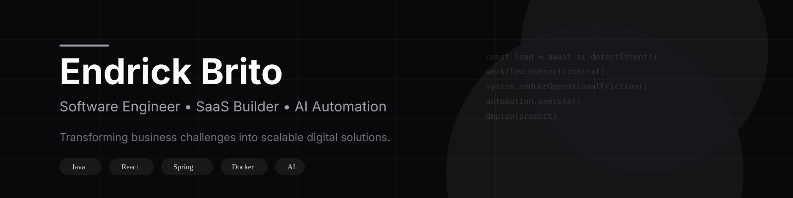

# Hi there, I'm Endrick Brito

### Software Engineer • SaaS Builder • AI Automation

Transforming business challenges into scalable digital solutions.

I build software focused on automation, operational efficiency, artificial intelligence, and SaaS products that solve real business problems.

---

## About Me

My journey into software started by solving operational problems.

What began with small automations evolved into building complete systems designed to connect processes, data, and people into efficient workflows.

Today, I focus on creating software that helps businesses:

* Automate repetitive tasks
* Recover lost opportunities
* Centralize operational information
* Improve decision-making
* Scale with confidence

I believe technology should simplify operations, not create more complexity.

---

## Current Focus

```yaml
Current Work:
  - SaaS Products
  - Business Automation
  - AI-Powered Systems

Building:
  - Lead Recall AI
  - Workflow Automation Platforms
  - Multi-Tenant SaaS Solutions

Interested In:
  - Artificial Intelligence
  - Event-Driven Architecture
  - System Design
  - Workflow Orchestration
  - Business Software

Mission:
  - Create software that generates real business value
```

---

## Featured Project

### Lead Recall AI

An AI-powered lead recovery platform designed to help businesses recover lost sales opportunities automatically.

Many companies lose potential customers because conversations are forgotten, inventory changes go unnoticed, or follow-ups never happen.

Lead Recall AI solves this by:

* Monitoring customer conversations
* Detecting purchase intent using AI
* Matching customers with available products
* Generating new opportunities automatically
* Supporting sales teams with actionable insights

### Tech Stack

<p>
  
  
  
  
  
  
</p>

**Links**
<p>
  <a href="https://leadrecallai.com">
    
  </a>

  <a href="https://github.com/SEU_USUARIO/lead-recall-ai">
    
  </a>

  <a href="https://seusite.com/case-study">
    
  </a>
</p>

---

## Development Philosophy

Most companies don't suffer from a lack of software.

They suffer from disconnected workflows, fragmented information, repetitive tasks, and operational friction.

The systems I build aim to:

* Connect information
* Automate processes
* Improve visibility
* Reduce manual work
* Support better decisions

Technology should quietly help businesses operate better.

---
## Tech Stack

<table>
<tr>
<td valign="top" width="25%">

### Frontend

React  
Next.js  
TypeScript  
JavaScript  
Tailwind CSS

</td>
<td valign="top" width="25%">

### Backend

Java  
Spring Boot  
Node.js  
REST APIs

</td>
<td valign="top" width="25%">

### Data

MySQL  
PostgreSQL  
Redis

</td>
<td valign="top" width="25%">

### AI & Infra

Python  
OpenAI  
Groq  
Ollama  
Docker  
Linux

</td>
</tr>
</table>

<p align="center">
  
</p>
---

## Areas of Interest

* Artificial Intelligence
* SaaS Development
* Workflow Automation
* Event-Driven Architecture
* System Design
* Operational Software
* CRM Integrations
* Business Intelligence

---

## Current Projects

* Lead Recall AI
* AI-Powered Business Automation
* Operational Dashboards
* Workflow Orchestration Systems
* Multi-Tenant SaaS Platforms
* CRM & WhatsApp Integrations

---

## GitHub Stats

<p align="center">
  
  
</p>

---

## Connect

<p>
  <a href="https://github.com/endbit">
    
  </a>
</p>

---

### Building software that solves real business problems.

Technology should simplify operations, not complicate them.
